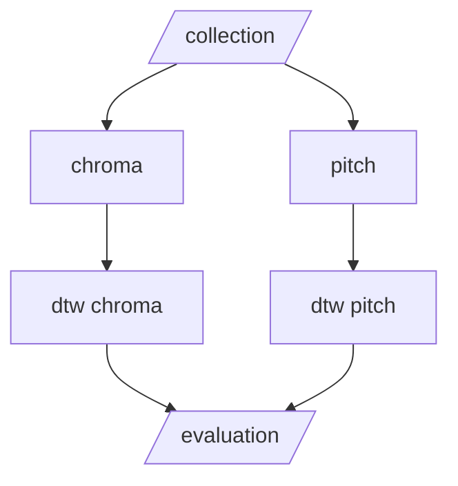

# QBH Catalog
Evaluation of Vocal Source Separation Models for Automatic Generation of Query-by-Humming Database

[**Paper**](Evaluation_of_Vocal_Source_Separation_Models_for_Automatic_Generation_of_Query_by_Humming_Database.pdf)

## Pipeline



## How to run

**Clone the repository**

```bash
git clone https://github.com/enter-opy/qbh-catalog.git
cd qbh-catalog
```

**Create and activate conda environment**

```bash
conda create -n qbh python=3.10
conda activate qbh
```

**Install dependencies**

```bash
pip install -r requirements.txt
```

**Run notebooks**

```bash
jupyter notebook
```


